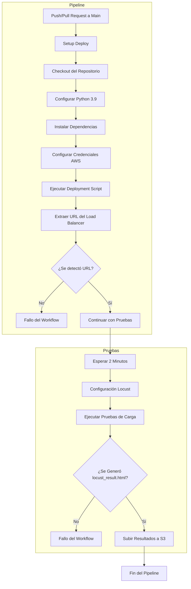

# Documentación del CI/CD Pipeline del Proyecto

Este documento describe el flujo de trabajo automatizado del pipeline de CI/CD, incluyendo un diagrama en **Mermaid**, una explicación detallada de cada parte, su ubicación en el repositorio y algunos consejos útiles.

---

## **1. Diagrama del Workflow**

Aquí se muestra el diagrama del flujo de trabajo:



---

## **2. Explicación del Diagrama**

Este diagrama ilustra el flujo completo del pipeline de CI/CD descrito en el archivo `ci_cd_workflow.yml`.

### **Etapas del Pipeline:**

1. **Inicio:** Se activa cuando se realiza un **push**, un **pull request** a la rama `notmain` o mediante una ejecución manual (`workflow_dispatch`).

2. **Setup Deploy (Despliegue):** 
   - Se realizan los siguientes pasos:
     - `Checkout del Repositorio`: Clona el repositorio en la máquina virtual (`actions/checkout@v4`).
     - `Configurar Python`: Instala y configura Python 3.9 (`actions/setup-python@v4`).
     - `Instalar Dependencias`: Instala `boto3`, `Flask`, `awscli`, etc., necesarias para ejecutar `deployment.py`.
     - `Configurar Credenciales AWS`: Autentica con los secretos de AWS.
     - `Ejecutar Script de Despliegue`: Despliega la aplicación en AWS EC2 mediante `src/deployment.py`.
     - `Extraer URL del Load Balancer`: Se extrae la URL del Load Balancer de la salida del script.

   **Validación de URL:** 
   - Si no se detecta una URL válida, el workflow falla con un mensaje de error.
   - Si la URL es correcta, continúa con la etapa de pruebas.

3. **Pruebas de Carga (`performance`):**
   - **Tiempo de espera:** Se espera 2 minutos (`sleep 120`) para garantizar que el Load Balancer esté listo.
   - **Configuración de Locust:** Se instala Locust para realizar la prueba de carga.
   - **Prueba de Carga:** Se simulan 1000 usuarios concurrentes, agregando 20 usuarios por segundo, durante 1 minuto.
   - **Validación del Reporte:** Si no se genera `locust_result.html`, el workflow falla con un error. Si se genera, sube el archivo al bucket S3.

4. **Subida de Resultados a S3:**
   - Verifica si el bucket `performance-reports-bucket` existe. Si no, lo crea.
   - Sube el archivo `locust_result.html` al bucket.

5. **Finalización del Pipeline:**
   - Si todos los pasos se completan correctamente, el pipeline finaliza con éxito.

---

## **3. Ubicación del Archivo**

El archivo `ci_cd_workflow.yml` debe ubicarse en la carpeta `.github/workflows/` dentro del repositorio. 

El archivo de documentación `ci_cd_pipeline_documentation.md` puede ubicarse en:
- La **carpeta raíz del repositorio (`/`)** si es un archivo principal.
- La carpeta **`docs/`** si prefieres tener una estructura organizada para la documentación.
- **Ejemplo de ruta:**
  ```bash
  /docs/ci_cd_pipeline_documentation.md
  ```

---

## **4. Consejos Adicionales**

1. **Documentación Clara:** Asegúrate de mantener los comentarios actualizados en el archivo `ci_cd_workflow.yml` para facilitar la lectura y mantenimiento del pipeline.
   
2. **Enlace en el `README.md`:** Puedes agregar un enlace al archivo de documentación desde el `README.md`:
   ```markdown
   [Ver la Documentación del Pipeline de CI/CD](./docs/ci_cd_pipeline_documentation.md)
   ```

3. **Uso de Variables de Entorno:** 
   - Mantén las credenciales AWS seguras en los `secrets` de GitHub.
   - No almacenes información sensible directamente en el archivo YAML.

4. **Pruebas Locales:** Antes de subir cambios al pipeline, ejecuta los scripts (`deployment.py`, `locustfile.py`) localmente para identificar errores con anticipación.

---

### **Resumen:**
Este archivo contiene:
1. Un diagrama Mermaid que muestra el flujo de trabajo.
2. Explicación detallada de las etapas del pipeline (`setup_deploy` y `performance`).
3. Información sobre la ubicación recomendada de los archivos.
4. Consejos prácticos para mejorar la seguridad y el mantenimiento del pipeline.

Con esta estructura, tienes una documentación clara y completa que puedes incluir directamente en tu repositorio.
