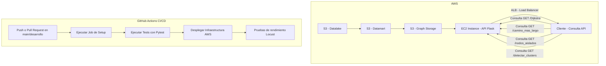

# Proyecto GraphWord - Sistema Distribuido de Grafos en AWS



## Descripción General
Este proyecto implementa una arquitectura distribuida en AWS para gestionar y realizar operaciones sobre grafos generados a partir de conjuntos de palabras.

## Flujo de Trabajo de CI/CD
1. **Evento de activación:**
   - Push o Pull Request en las ramas `main` o `develop`.
   - Despliegue automático solo en la rama `main`.
2. **Jobs:**
   - **Setup:** Instalación de dependencias y configuración de Python.
   - **Tests:** Pruebas con `pytest`.
   - **Deploy:** Despliegue de infraestructura en AWS con `deployment.py`.
   - **Performance:** Pruebas de rendimiento con `Locust`.

## CI/CD - Archivo `ci.yml`
```yaml
name: CI/CD Pipeline

on:
  push:
    branches:
      - main
      - develop
  pull_request:
    branches:
      - main
      - develop
  workflow_dispatch:

jobs:
  setup:
    name: Preparar entorno de trabajo
    runs-on: ubuntu-22.04

    steps:
      - name: Checkout del repositorio
        uses: actions/checkout@v4

      - name: Configurar Python 3.9
        uses: actions/setup-python@v4
        with:
          python-version: "3.9"

      - name: Instalar dependencias
        run: |
          python -m pip install --upgrade pip
          pip install boto3 Flask pytest

  tests:
    name: Ejecutar pruebas unitarias
    runs-on: ubuntu-22.04
    needs: setup

    steps:
      - name: Checkout del repositorio
        uses: actions/checkout@v4

      - name: Ejecutar pruebas con pytest
        run: pytest

  deploy:
    name: Desplegar infraestructura en AWS
    runs-on: ubuntu-22.04
    needs: tests
    if: github.ref == 'refs/heads/main'

    steps:
      - name: Checkout del repositorio
        uses: actions/checkout@v4

      - name: Configurar credenciales AWS
        uses: aws-actions/configure-aws-credentials@v2
        with:
          aws-access-key-id: ${{ secrets.AWS_ACCESS_KEY_ID }}
          aws-secret-access-key: ${{ secrets.AWS_SECRET_ACCESS_KEY }}
          aws-region: "us-east-1"

      - name: Desplegar aplicación en AWS EC2
        run: python src/deployment.py

  performance:
    name: Pruebas de rendimiento con Locust
    runs-on: ubuntu-22.04
    needs: deploy

    steps:
      - name: Clonar repositorio
        uses: actions/checkout@v4

      - name: Configurar Locust
        run: |
          pip install locust
          locust -f src/locustfile.py --headless -u 100 -r 10 -t 1m
```

## Instrucciones para Ejecutar el Proyecto
1. **Configurar Secretos en GitHub:**
   - `AWS_ACCESS_KEY_ID`: Clave de acceso de AWS.
   - `AWS_SECRET_ACCESS_KEY`: Clave secreta de AWS.

2. **Pruebas de Carga:**
   Ejecuta las pruebas de rendimiento con Locust:
   ```bash
   locust -f src/locustfile.py --headless -u 100 -r 10 -t 1m
   ```

3. **Comandos para Scripts Locales:**
   ```bash
   # Crear datalake
   python src/create_datalake.py

   # Crear datamart
   python src/create_datamart.py

   # Construir grafo
   python src/create_graph.py

   # Ejecutar la API local
   python src/create_api.py
   ```

## Diagrama de Arquitectura
El diagrama anterior muestra la arquitectura general del proyecto, donde las consultas a la API Flask se realizan mediante un balanceador de carga (ALB) y los datos se almacenan y procesan en buckets S3.

---
Este archivo `README.md` detalla el flujo de CI/CD, el uso de secretos y los comandos para ejecutar los scripts de manera local y remota.
